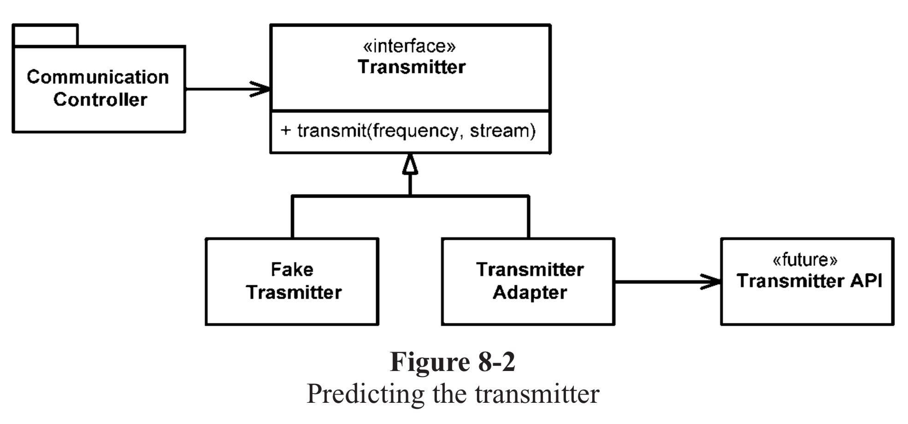

# 8장 경계

외부코드를 내부코드에 깔끔하게 통합하기 위한 기법과 기교를 살펴본다.

<br />

## 외부 코드 사용하기
- 패키지 제공자는 적용성을 넓힌다.
- 사용자는 자신의 요구에 필요한 인터페이스에 집중하기를 바란다.
### 문제점
1) Map 사용자라면 누구나 Map 내용을 지울 권한이 있다.
```java
clear() void - Map
containsKey(Object key) boolean - Map
entrySet() Set - Map
get(Object key) Object - Map
```

2) Map은 객체 유형을 제한하지 않는다.
```java
Map sensors = new HashMap();
Sensor s = (Sensor)sensors.get(sensorId);

// 사용자에게 필요하지 않은 기능까지 제공한다는 문제점이 남아있다.
Map<String, Sensor> sensors = new HashMap<Sensor>();
Sensor s = sensors.get(sensorId);
```
### 해결
- 경계 인터페이스인 Map을 Sensors 안으로 숨김으로 Map 인터페이스가 변하더라도 나머지 프로그램에는 영향을 미치지 않는다.
- 프로그램에 필요한 인터페이스만 제공한다.
- 경계 인터페이스를 이용할 때는 이를 이용하는 클래스나 클래스 계열 밖으로 노출되지 않도록 주의한다.
```java
public class Sensors {
    private Map sensors = new HashMap();
    
    public Sensor getById(String id) {
        return (Sensor) sensors.get(id); 
    }
}
```
<br />

## 경계를 살피고 익히기
- 외부에서 가져온 패키지에서 우리가 사용할 코드를 테스트하는 편이 바람직하다.
- 학습 테스트는 통제된 환경에서 프로그램에서 사용하려는 방식대로 API를 호출하고 제대로 이해하고 있는지 확인하는 방법이다.

```java
public class LogTest {
    private Logger logger;
    
    @Before
    public void initialize() {
        logger = Logger.getLogger("logger");
        logger.removeAllAppenders();
        Logger.getRootLogger().removeAllAppenders();
    }
    
    @Test
    public void basicLoger() {
        BasicConfigurator.configure();
        logger.info("basicLogger");
    }
    
    @Test
    public void addAppenderWithStream() {
        logger.addAppender(new ConsoleAppender(
              new PatternLayout("%p % t %m%n"),
              ConsoleAppender.SYSTEM_OUT));
        logger.info("addAppenderWithStream");
    }
}
```
<br/>

## 아직 존재하지 않는 코드를 사용하기
- 때로는 우리 지식이 경계를 너머 미치지 못하는 코드 영역도 있다.


```java
public interface Transimitter {
    public void transmit(Frequency freq, Stream stream);
}
 
public class FakeTransmitter implements Transimitter {
    ...
    public void transmit(Frequency freq, Stream stream) {
        return;
    }
    ...
}
 
public class TransmitterAdapter implements Transimitter {
    ...
    public void transmittransmit(Frequency freq, Stream stream) {
        useTransmitterAPI(freq, stream);
    }
    ...
}
 
public class CommunicationController {
    ...
    public void commuicateWithTransmitter() {
        //Transmitter transmitter = new FakeTransmitter();
        //transmitter.transmit(freq, stream);
 
        Transmitter transmitter = new TransmitterAdapter();
        transmitter.transmit(freq, stream);
 
    }
    ...
}

```

## 결론
- 경계에 위치하는 코드는 깔끔히 분리한다.
- 기대치를 정의하는 테스트 케이스도 작성한다.
- 외부 패키지를 호출하는 코드를 가능한 줄여 경계를 관리한다.
- 새로운 클래스로 경계를 감싸거나 ADAPTER 패턴을 사용해 우리가 원하는 인터페이스를 패키지가 제공하는 인터페이스로 변환한다.